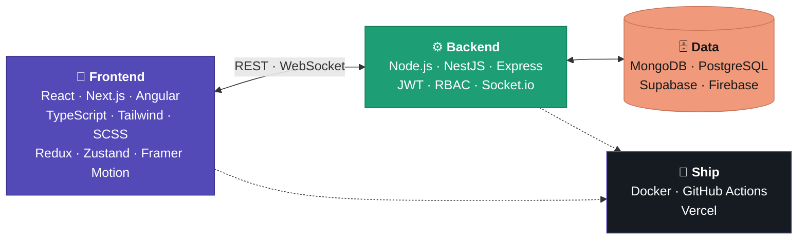

<div align="center">


<a href="https://github.com/NMHx2005">
  
</a>

<p>
  
  <a href="https://github.com/NMHx2005?tab=followers"></a>
  
</p>

<p>
  <a href="mailto:22092005nguyenhung@gmail.com"></a>
  <a href="https://t.me/nmhx_white"></a>
  <a href="https://web.facebook.com/profile.php?id=100084510032828"></a>
</p>

</div>

---

## `$ whoami`

```typescript
const hung = {
  name       : "Nguyễn Mạnh Hùng",
  alias      : "NMHx",
  location   : "Hoàng Mai, Hà Nội 🇻🇳",
  role       : "Fullstack Developer",
  experience : "2–3 years",
  building   : ["LMS & admin dashboards", "Realtime chat & video", "SEO-first marketing sites", "Dev tools for AI agents"],
  nowShipping: "crossweave",
  openTo     : ["Full-time", "Freelance", "Collaboration"],
  contact    : { email: "22092005nguyenhung@gmail.com", telegram: "@nmhx_white" },
  motto      : "The best code is not the one that works — it's the one that still makes sense at 2am.",
} as const;
```

---

## 🚀 Spotlight — [crossweave](https://github.com/NMHx2005/crossweave)

> **Run N parallel AI coding agents on one repo, safely.**
> Your agents are the warp threads — crossweave is the weft that holds the fabric together.

<p>
  <a href="https://github.com/NMHx2005/crossweave/releases"></a>
  <a href="https://github.com/NMHx2005/crossweave/actions/workflows/ci.yml"></a>
  
  
  
</p>

A local-first layer that sits **above** Claude Code, Cursor Agent and any [ACP](https://agentclientprotocol.com)-compatible agent:

- 🧵 **Worktree isolation** — every agent gets its own git worktree *and* its own runtime (ports, DB, Docker, cache)
- 📡 **Collision radar** — spots agents about to touch the same code before they conflict
- 🔀 **Convergence-based auto-merge** — merges work back once it's proven to fit together
- 🖥️ **Live TUI** — watch every agent in one terminal

---

## 💼 Featured Projects

| Project | What it does | Stack | Links |
|---|---|---|---|
| 🎓 **[LMS Platform](https://github.com/NMHx2005/lms-backend)** | Full learning platform — JWT auth, role-based access (Student / Teacher / Admin), courses → sections → lessons, enrollment, subscription plans | `React` `Vite` `Express` `TypeScript` `MongoDB` `Docker` | [Demo](https://lms-frontend-mocha-eight.vercel.app) · [FE](https://github.com/NMHx2005/lms-frontend) · [BE](https://github.com/NMHx2005/lms-backend) |
| 💬 **[Chat System](https://github.com/NMHx2005/chat_system_BE)** | Realtime text & video chat — 54 REST endpoints, groups & channels, file upload, PeerJS video calls, admin panel | `Angular 18` `Express` `MongoDB` `Socket.io` `PeerJS` | [Demo](https://chat-system-fe-opal.vercel.app) · [FE](https://github.com/NMHx2005/chat_system_FE) · [BE](https://github.com/NMHx2005/chat_system_BE) |
| 🔬 **[Project Chíp Chíp](https://github.com/NMHx2005/chip_chip)** | Bilingual (VI / EN) non-profit semiconductor learning community for high-school students — lessons, forum, admin CMS | `Next.js` `Supabase` `next-intl` `Tiptap` `Framer Motion` | [Repo](https://github.com/NMHx2005/chip_chip) |
| 🏢 **[MinhLoc Group](https://github.com/NMHx2005/MinhLoc_FE)** | Client real-estate website, built SEO-first — SSR/SSG, JSON-LD structured data, sitemap, optimized images | `Next.js 14` `TypeScript` `Material UI` `Docker` | [Repo](https://github.com/NMHx2005/MinhLoc_FE) |

---

## 🧩 How I Build



---

## 🛠 Tech Stack

<div align="center">

| | |
|:---:|:---|
| **Frontend** |  |
| **Backend** |  |
| **Data & Cloud** |  |
| **Tooling** |  |

</div>

---

## 📊 GitHub Stats

<div align="center">









<a href="https://git.io/streak-stats">
  
</a>

</div>

---

## 🐍 Contribution Snake

<div align="center">

<picture>
  <source media="(prefers-color-scheme: dark)" srcset="https://raw.githubusercontent.com/NMHx2005/NMHx2005/output/github-snake-dark.svg"/>
  <source media="(prefers-color-scheme: light)" srcset="https://raw.githubusercontent.com/NMHx2005/NMHx2005/output/github-snake.svg"/>
  
</picture>

</div>

---

<div align="center">

### 📫 Let's build something great

Have a product idea, a freelance gig, or a full-time role? I reply fastest on **Telegram**.

<a href="mailto:22092005nguyenhung@gmail.com"></a>
<a href="https://t.me/nmhx_white"></a>


</div>
